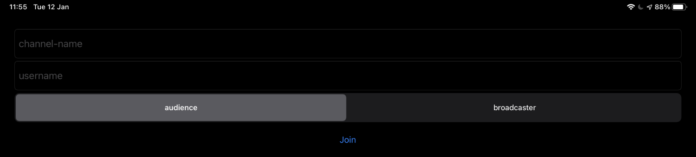
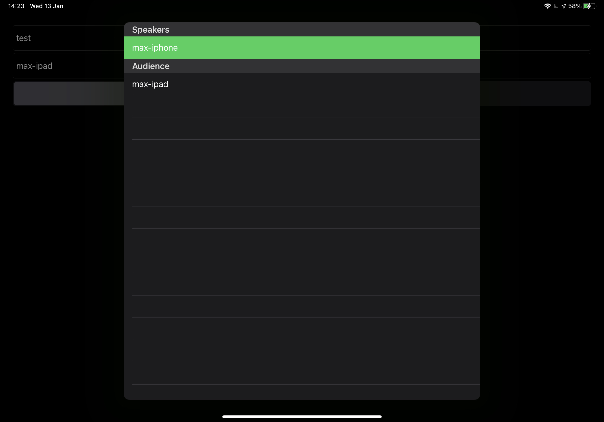

# Agora Audio Streaming Example

With this example project, you can create a channel for audio streaming, being either a broadcaster or audience member. Also using RTM to share usernames.

View once inside a channel:

## Requirements

- An Agora developer account (see [How To Get Started with Agora](https://www.agora.io/en/blog/how-to-get-started-with-agora?utm_source=medium&utm_source=medium&utm_medium=github&utm_campaign=agora-audio-ios))
- Xcode 11.0 or later.
- An iOS device running on iOS 12.0 or later.
- A basic understanding of iOS development.
- Cocoapods

# Setup

Run `pod install --repo-update` and open up the .xcworkspace file.

Add your Agora App ID into the placeholder, then build + run on an iOS device.